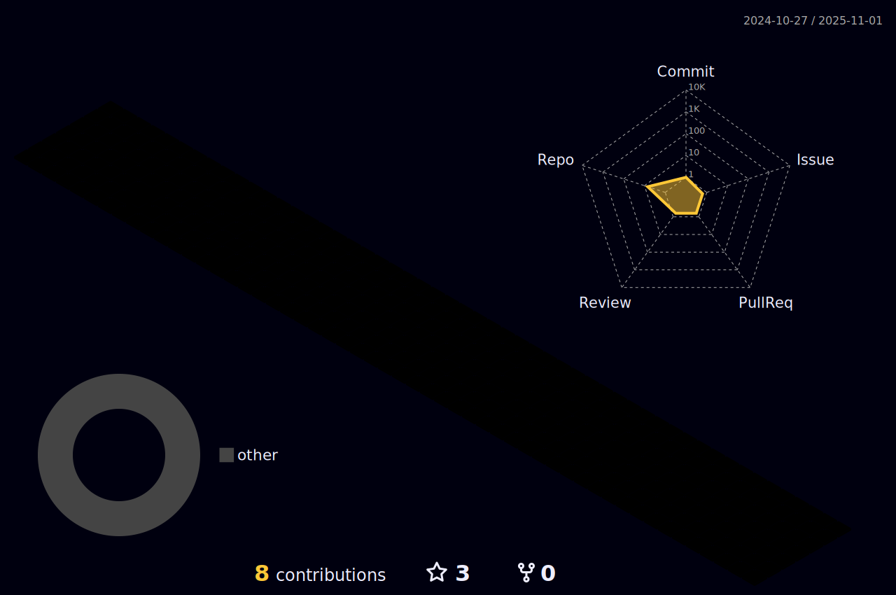

<h1 align="center">Hi 👋, I'm Can Zhang</h1>
<h3 align="center">A passionate graduate student from Beijing University of Chemical Technology (BUCT) exploring the frontiers of Multimodal AI.</h3>

  

- 🎓 I'm currently a graduate student at **Beijing University of Chemical Technology (BUCT)**.
- 🔭 My research focuses on **Multimodal Large Language Models (MLLMs)**.
- 🌱 I'm particularly interested in:
    - **Multimodal Retrieval**: Finding the most relevant information across different data types.
    - **Vision-Language Grounding**: Connecting textual concepts to visual data.
    - **Model Quantization**: Making large models more efficient and accessible.
- 📫 How to reach me: **alexlessend@gmail.com**
### 🚀 Skills & Tools

  
  
  
  
  

---

### 📊 My GitHub Stats

  
  

---
 

<!--
**aub123/aub123** is a ✨ _special_ ✨ repository because its `README.md` (this file) appears on your GitHub profile.

Here are some ideas to get you started:

- 🔭 I’m currently working on ...
- 🌱 I’m currently learning ...
- 👯 I’m looking to collaborate on ...
- 🤔 I’m looking for help with ...
- 💬 Ask me about ...
- 📫 How to reach me: ...
- 😄 Pronouns: ...
- ⚡ Fun fact: ...
-->
